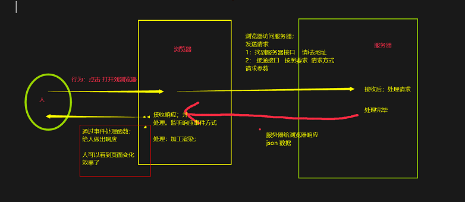

### 交互过程

### 服务器
- ip 找到服务器
- 端口号 找到接口
- /a/b 找到接口 要json数据

一个服务器可以启动多个服务  一个服务可以写多个接口 每个接口可以响应数据 数据格式为xml或者json格式

### 浏览器是如何发送请求
1.通过请求地址找接口
  - 404 没找到 地址错误 或者找到了 没响应
2.按照接口要求接口接通接口
  - 要求一 指定请求方式 get post pull delete
  - 要求二 需要请求参数 json格式 json字符串 json对象

  以上都满足后 接口接通 服务器处理请求 ---> 服务端开发人员的工作

### 如何接收响应并处理
1.怎么接收
    1.1 响应内容 全部放在 xmlHttpRequest 对象中
    1.2 通过监听响应事件 xmlHttpRequest.onreadystatechange
    1.2 在响应事件处理函数内部 处理响应事件
   -  xmlHttpRequest.status 获取http 状态码
   -  xmlHttpRequest.readyStatus 获取状态
   -  xmlHttpRequest.respose 获取响应体中数据 json数据or xml

2.怎么处理
    2.1 根据dom结构 分析页面需要的数据结构
    2.2 将相应数据加工处理 得到符合页面的数据结构
    2.3 通过事件处理 完成js动态交互

3.注意事项
    交互是异步的 事件处理函数 ajax请求
    响应处理需要等待响应成功再处理
   - 1.dom 处理在响应处理函数里面写
   - 2.要么在回调函数中处理dom 在响应处理函数中执行回调函数 并传入实参响应数据
   - 在回调函数的方法体中 接收响应数据 并进行dom 操作

### 有没有什么状态是记录请求与响应的过程
- 0 请求准备中 open() 之前
- 1 发送请求了 send() 之后
- 2 服务器处理中 (java开发的工作)
- 3 响应发出中 (java开发的工作)
- 4 响应成功 浏览器接收响应

0 1 4 前端开发工作 2 3 服务端开发工作

### http 状态码
代表整个通信中的所有问题
- 200 成功
- 400 前端bug
- 404 地址错误或没有相应(85%都是地址错误)
- 500 服务器错误
